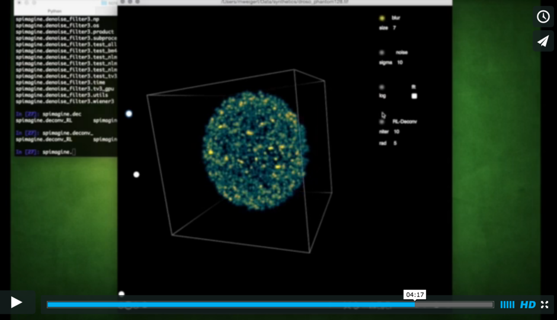

# SpImagine

A python package to interactively visualize and process  time lapsed volumetric data as generated with modern light sheet microscopes. The package provides a generic 3D+t data viewer as well as denoising and deconvolution methods and makes use of GPU acceleration via OpenCL. 


[](https://vimeo.com/126597994)

## Requirements

A working OpenCL environment

* Mac

	should be provided by default :)

* Linux
	e.g. for nvidia cards, install the latest drivers and then the opencl lib/headers

	```
	apt-get install opencl-header  nvidia-libopencl1-35 nvidia-opencl-icd-352
	```


	

## Installing


* Mac

	install PyQt4, e.g. with homebrew:
	```
	brew install pyqt
	```

	then with pip
	```
	pip install --user git+https://github.com/maweigert/gputools
	pip install --user git+https://github.com/maweigert/spimagine
	```

	or the developmental branch
	```
	pip install --user git+https://github.com/maweigert/spimagine@develop
	```
	
* Linux

	```
	apt-get install python-qt4 python-qt4-gl

	pip install --user git+https://github.com/maweigert/gputools
	pip install --user git+https://github.com/maweigert/spimagine
	```

## Usage

### Gui Application

pip should install the standalone viewer in the local bin folder (e.g. "~/.local/bin" on Linux), run it from the command line like that

```
spimagine [input]
```

Right now the following formats are supported as input 

- tiff files
- a folder containing tiff files
- 16 bit unsigned raw data in the format used by the Myers Group at mpi-cbg


### interactive usage

the package provides interactive visualisation to be used e.g. within IPython

```python 
	from spimagine import volshow, volfig

	data = ...          #3d or 4d numpy array
	
	volfig(0)           #optional: similar behaviour like matplotlib.figure, e.g. can be omitted
	
	volshow(data)       #render the data
````

### basic configuration 

the default parameters (colormap/render width...) can be set by creating the config file "$HOME/.spimagine" and populating it with the default values, e.g.

```opencldevice = 0
   max_steps  = 200
   width = 600
   colormap = hot
```

### setting the GPU to be used:

interactively:

```python 
	import gputools
	gputools.init_device(useDevice = 1)
```

or in the config file ".spimagine" in your home folder

    OPENCLDEVICE = 1
